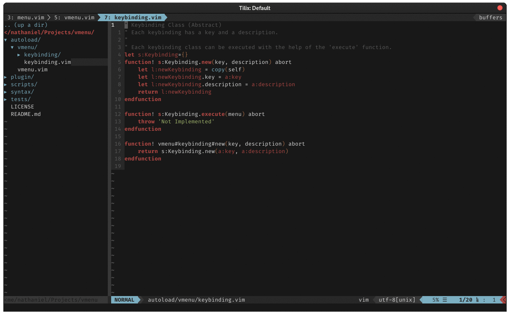

# VMenu

(Neo)Vim Menu that maps keys to actions inspired by [Spacemacs](https://www.spacemacs.org/).



## Install

You can use your favorite vim plugin manager.
An example with [vim-plug](https://github.com/junegunn/vim-plug):

```vim
Plug 'nathanielsimard/vmenu'
```

## Vim Users

Vim needs to be in `nocompatible` mode to use the filetype keybindings.

```vim
set nocompatible
```

## Usage

We are building a graph that can be navigated with keybindings.

### Functional API

Not implemented.

### Object Oriented API

This API is the most flexible one, each keybinding is an object.
First, we can define the root and the native vim keybinding to show the vmenu.

```vim
let g:menu = vmenu#new() " Everything is an object, even the menu.
let g:keybindings_root = vmenu#keybinding#category#new('no important', 'Keybinding Menu')
nnoremap <silent> <Space> :call g:keybindings_root.execute(g:menu)<CR>
```

But there is no keybindings to show, we need to add some.
For example, we may want to add a keybinding to show all open buffers.

```vim
call g:keybindings_root.add(vmenu#keybinding#command#new('b', 'List All Buffers', 'buffers'))
```

But what if we want to have another menu that list all the actions available on buffers with `b`.
We can create another category keybinding object and then add the `List All Buffers` keybinding.

```vim
let g:keybindings_buffer = vmenu#keybinding#category#new('b', 'Buffer')
call g:keybindings_buffer.add(vmenu#keybinding#command#new('b', 'List All Buffers', 'buffers'))
call g:keybindings_buffer.add(vmenu#keybinding#command#new('n', 'Next Buffer', 'bn'))
...
```

Also, we must not forget to add the new category keybinding to the root.

```vim
call g:keybindings_root.add(g:keybindings_buffer)
```

It is possible to have category keybindings that are aware of the current filetype to only show the appropriate keybindings.

```vim
let g:keybindings_refactor = vmenu#keybinding#filetype#new('r', 'Refactoring')
call g:keybindings_refactor.add(vmenu#keybinding#command#new('a', 'Alway visible', 'AlwaysVisibleCommand'))
call g:keybindings_refactor.add_filetype('python', vmenu#keybinding#command#new('f', 'Format File', 'PythonFormaterCommand'))
call g:keybindings_refactor.add_filetype('c', vmenu#keybinding#command#new('f', 'Format File', 'CFormaterCommand'))
...
```

In this example, the `Format File` option will only be displayed on `python` and `c` files and use the appropriate formater for each filetype.

## Limitations

In order to have zero side-effect with other keybindings, the implementation does not use `map`, `nmap`, etc.
For now, it means that only one caracter key can be set for each menu entry,
Also, keys like `<S-a>` or `<S-2>` are not supported, just use the corresponding caracter `A` or `@`.

